# MVP – Engenharia de Dados: Necessidade de Estoque para a Black Friday

**Pós-graduação em Ciência de Dados e Analytics – PUC-Rio | Sprint 3: Engenharia de Dados**
**Aluna:** Laura Gouvea
**Matrícula**: 4052026000223

Pipeline de dados em nuvem (Databricks Free Edition), com arquitetura medalhão (Bronze > Silver > Gold), modelo dimensional em esquema estrela, catálogo de dados no Unity Catalog, análise de qualidade e respostas às perguntas de negócio.

---

## Resumo executivo

**Pergunta:** terei estoque para vender R$ 2 milhões em novembro (Black Friday)?

**Resposta curta:** o efeito natural da Black Friday sobre a base de 2018 projeta **R$ 1,50M (75% da meta)**. Atingir R$ 2M exigiria o **dobro das unidades** vendidas em nov/2017 nos produtos da curva A. A recomendação é estocar para o cenário projetado (~1,5x nov/2017) e condicionar a compra adicional a ações comerciais (conforme capacidade operacional da empresa) que justifiquem o gap, evitando capital parado em estoque e que fechem o gap de R$ 504 mil.

---

## Estrutura do repositório

| Pasta / arquivo | Conteúdo |
|---|---|
| `notebooks/01_bronze_ingestao.ipynb` | Ingestão dos 9 CSVs brutos em tabelas Delta (camada Bronze) |
| `notebooks/02_qualidade.ipynb` | Diagnóstico de qualidade dos dados na Bronze |
| `notebooks/03_silver.ipynb` | Limpeza, tipagem e regras de negócio (camada Silver) |
| `notebooks/04_gold.ipynb` | Esquema estrela, chaves PK/FK e catálogo de dados (camada Gold) |
| `notebooks/05_analise.ipynb` | Consultas e discussão de cada pergunta de negócio |
| `prints/` | Evidências de execução no Databricks |

---

## 1. Contexto de Negócios e Perguntas (Etapa 2 e 4.1)

### Contexto

Em e-commerce, a Black Friday concentra uma fatia desproporcional da receita do ano. Planejar o estoque para a data é uma decisão de alto risco: estoque de menos gera ruptura e venda perdida, e estoque demais gera capital parado.

### Objetivo

> **Quero entender se terei estoque disponível para atingir a meta de vendas de R$ 2 milhões em novembro (Black Friday).**

Como a base utilizada não possui dados de estoque, o pipeline calcula a **necessidade de estoque**, ou seja, quanto é preciso ter de cada produto para atingir a meta. A comparação com o estoque disponível fica declarada como pergunta não respondida (P6).

**Premissas:**
- A Black Friday de 24/11/2017 é a referência do "ano anterior".
- A meta de **R$ 2M em novembro/2018 é hipotética**, definida para fins do exercício.
- Período de análise: jan/2017 a ago/2018. As pontas da base (2016 e set–out/2018) têm poucos pedidos e ficam fora das comparações mensais.

### Perguntas de negócio

| # | Pergunta | Status |
|---|---|---|
| P1 | Quais produtos e categorias formam as curvas A, B e C (80/15/5% da receita)? | Respondida |
| P2 | Qual foi a participação de cada categoria nas vendas da Black Friday 2017? | Respondida |
| P3 | O mix de uma campanha comparável (Dia das Mães/2018) se parece com o da Black Friday? | Respondida |
| P4 | Quanto a Black Friday representa sobre um mês normal, e qual crescimento é necessário para R$ 2M? | Respondida |
| P5 | Mantendo o mix e o preço médio da BF 2017, quantas unidades da curva A são necessárias para bater R$ 2M? | Respondida |
| P6 | O estoque disponível cobre essa necessidade? | **Não respondida** (a base não tem estoque) |

---

## 2. Carga dos Dados (Etapa 4.2)

### Fonte

- **Dataset:** [Brazilian E-Commerce Public Dataset by Olist](https://www.kaggle.com/datasets/olistbr/brazilian-ecommerce) (Kaggle)
- **Conteúdo:** cerca de 100 mil pedidos reais e anonimizados de marketplaces brasileiros, de set/2016 a out/2018, em 9 arquivos CSV relacionados.
- **Licença:** [CC BY-NC-SA 4.0](https://creativecommons.org/licenses/by-nc-sa/4.0/). Permite uso não comercial com citação da fonte, que é o caso deste trabalho acadêmico.

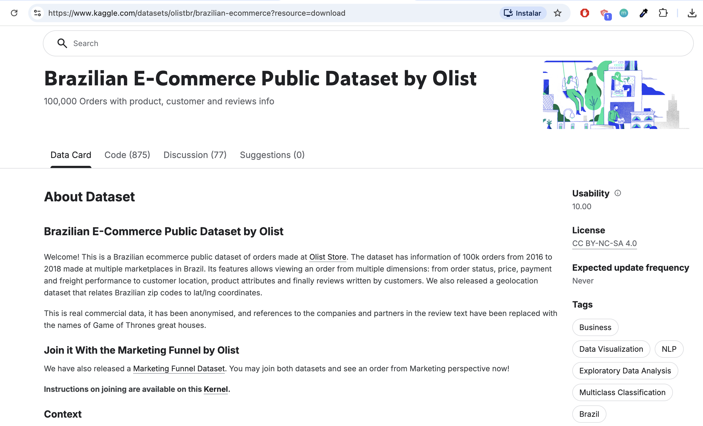

### Carga na nuvem

1. Os 9 CSVs foram baixados do Kaggle.
2. No Databricks, foi criado o catálogo `mvp_olist`, com os schemas `bronze`, `silver` e `gold` (arquitetura medalhão) e o Volume `bronze.raw_files`, que funciona como área de arquivos brutos do Data Lake.
3. Os CSVs foram enviados ao Volume pela interface do Catalog Explorer (*Upload to this volume*).

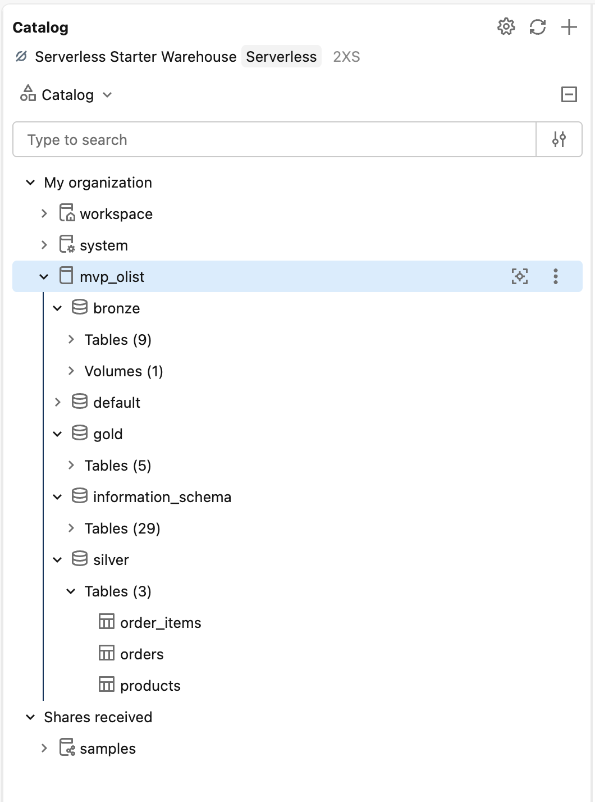

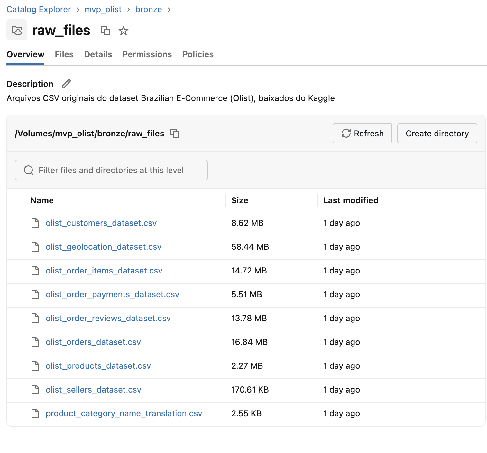

---

## 3. Modelagem e Catálogo de Dados (Etapa 4.3)

### Modelo dimensional: esquema estrela

O modelo foi projetado a partir das perguntas de negócio, seguindo a modelagem dimensional (Kimball): um fato central com medidas numéricas e aditivas e dimensões que respondem ao "quando" e ao "o quê" (5W1H).

- **Grão da `fato_vendas`:** 1 item de pedido (= 1 unidade vendida). Na fonte, cada linha de `order_items` representa uma unidade.
- **Medidas aditivas:** `quantidade`, `valor_venda` e `valor_frete`.
- **Dimensões degeneradas:** `order_id` e `order_item_id` ficam na própria fato.
- **Chaves substitutas (surrogate keys)** nas dimensões, com PK e FK declaradas no Unity Catalog.
- **Dimensão tempo rica:** calendário completo com flags de fim de semana, Black Friday e campanha comercial (Black Friday de sexta a segunda; Dia das Mães nas 2 semanas anteriores à data).
- Apenas **vendas válidas** entram na fato: pedidos `canceled` e `unavailable` são excluídos.

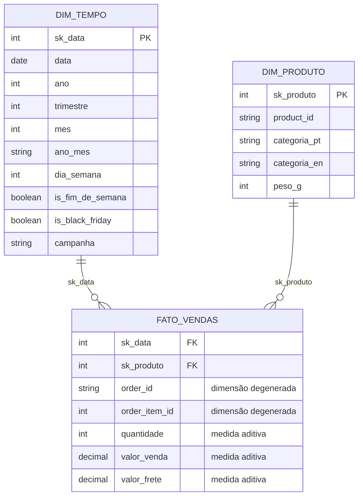
```mermaid
erDiagram
    DIM_TEMPO ||--o{ FATO_VENDAS : "sk_data"
    DIM_PRODUTO ||--o{ FATO_VENDAS : "sk_produto"

    FATO_VENDAS {
        int sk_data FK
        int sk_produto FK
        string order_id "dimensão degenerada"
        int order_item_id "dimensão degenerada"
        int quantidade "medida aditiva"
        decimal valor_venda "medida aditiva"
        decimal valor_frete "medida aditiva"
    }
    DIM_TEMPO {
        int sk_data PK
        date data
        int ano
        int trimestre
        int mes
        string ano_mes
        int dia_semana
        boolean is_fim_de_semana
        boolean is_black_friday
        string campanha
    }
    DIM_PRODUTO {
        int sk_produto PK
        string product_id
        string categoria_pt
        string categoria_en
        int peso_g
    }
```

Duas **views analíticas** foram criadas sobre o modelo: `vw_curva_abc` (classificação ABC por produto) e `vw_necessidade_estoque` (unidades necessárias por produto para a meta).

### Catálogo de dados

O catálogo foi implementado **no próprio Unity Catalog**, com `COMMENT` em todas as tabelas e colunas da Gold. Assim, a documentação fica junto dos dados e é visível para qualquer usuário do catálogo.

#### `gold.fato_vendas`: vendas no grão de 1 item de pedido

| Coluna | Tipo | Descrição | Domínio | Linhagem |
|---|---|---|---|---|
| sk_data | int | FK para dim_tempo (data da compra) | AAAAMMDD | silver.orders.order_purchase_ts |
| sk_produto | int | FK para dim_produto | 1 a 32.951 | dim_produto.sk_produto |
| order_id | string | Identificador do pedido (dimensão degenerada) | hash de 32 caracteres | silver.order_items.order_id |
| order_item_id | int | Sequencial do item no pedido | 1 a N | silver.order_items.order_item_id |
| quantidade | int | Unidades vendidas (medida aditiva) | sempre 1 | derivada |
| valor_venda | decimal(10,2) | Preço do item em R$ (medida aditiva) | > 0 (mín 0,85; máx 6.735) | silver.order_items.price |
| valor_frete | decimal(10,2) | Frete do item em R$ (medida aditiva) | ≥ 0 (0 = frete grátis) | silver.order_items.freight_value |

#### `gold.dim_produto`: o "o quê"

| Coluna | Tipo | Descrição | Domínio | Linhagem |
|---|---|---|---|---|
| sk_produto | int | Chave substituta (PK) | 1 a 32.951 | ROW_NUMBER() |
| product_id | string | Identificador original (chave natural) | hash de 32 caracteres | bronze.products.product_id |
| categoria_pt | string | Categoria em português | 73 categorias + `sem_categoria` | bronze.products |
| categoria_en | string | Categoria em inglês | fallback para PT quando sem tradução | bronze.products × bronze.category_translation |
| peso_g | int | Peso em gramas | ≥ 0; nulo em 2 produtos | bronze.products.product_weight_g |

#### `gold.dim_tempo`: o "quando"

| Coluna | Tipo | Descrição | Domínio | Linhagem |
|---|---|---|---|---|
| sk_data | int | Chave substituta (PK) | AAAAMMDD | gerada no pipeline |
| data | date | Data do calendário | 2016-09-01 a 2018-12-31 | sequence() |
| ano | int | Ano | 2016 a 2018 | derivada |
| trimestre | int | Trimestre | 1 a 4 | derivada |
| mes | int | Mês | 1 a 12 | derivada |
| ano_mes | string | Ano-mês | AAAA-MM | derivada |
| dia_semana | int | Dia da semana | 1 (dom) a 7 (sáb) | derivada |
| is_fim_de_semana | boolean | Sábado ou domingo | true / false | derivada |
| is_black_friday | boolean | Dia da Black Friday | 25/11/2016 e 24/11/2017 | regra de negócio |
| campanha | string | Campanha comercial | Black Friday, Dia das Mães, Sem campanha | regra de negócio |

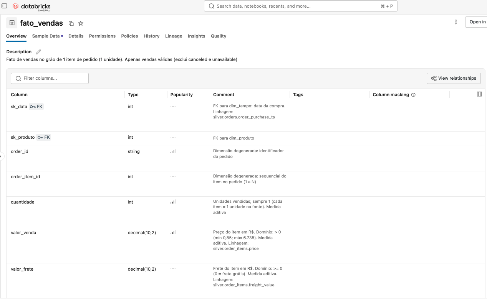

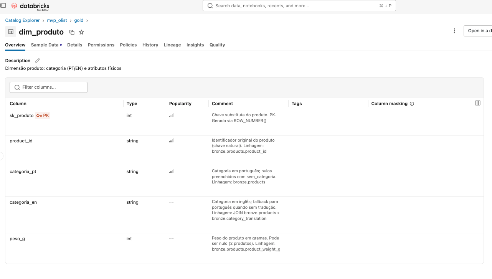

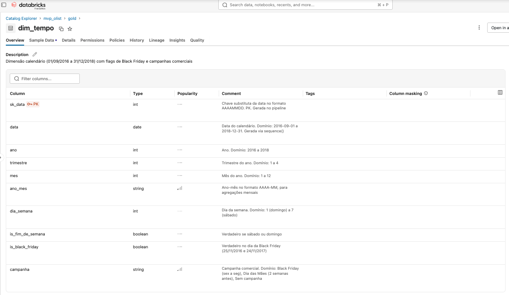

---

## 4. Pipeline de Dados (Etapa 4.4)

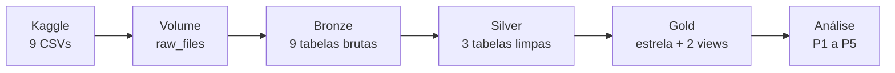
```mermaid
flowchart LR
    A[Kaggle<br/>9 CSVs] --> B[Volume<br/>raw_files]
    B --> C[Bronze<br/>9 tabelas brutas]
    C --> D[Silver<br/>3 tabelas limpas]
    D --> E[Gold<br/>estrela + 2 views]
    E --> F[Análise<br/>P1 a P5]
```

### Bronze: ingestão (`01_bronze_ingestao`)

- Leitura dos 9 CSVs do Volume e gravação como tabelas Delta, **sem transformação**.
- Todas as colunas são lidas como texto (`inferSchema=False`), para preservar o dado exatamente como veio da fonte.
- A opção `multiLine` trata os comentários das avaliações que contêm quebras de linha.
- Foram adicionados metadados de proveniência: `_ingestao_timestamp` e `_arquivo_origem`.
- As contagens batem com a fonte original, incluindo as 99.224 avaliações.

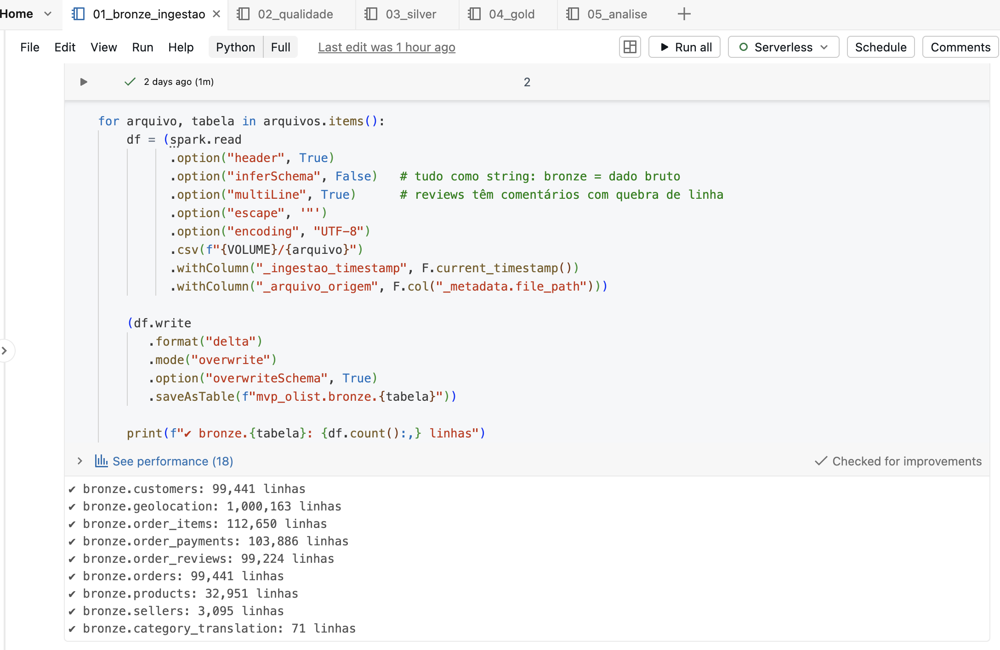

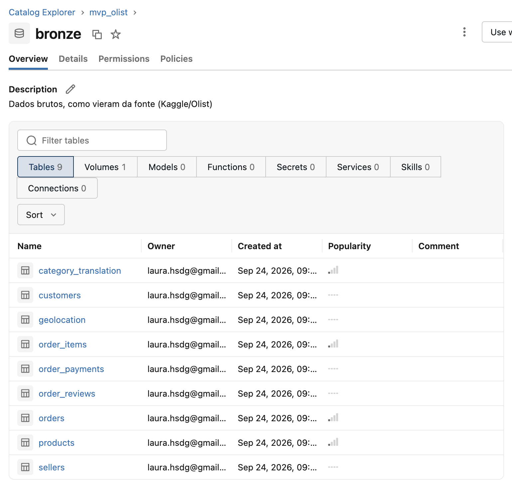

### Silver: limpeza e padronização (`03_silver`)

Só as 3 tabelas usadas pelo objetivo vão para a Silver: `orders`, `order_items` e `products`. Cada transformação é justificada por um achado do diagnóstico de qualidade (seção 5).

| Tabela | Transformações |
|---|---|
| orders | Datas convertidas de texto para timestamp; nova flag `is_venda_valida` (false para `canceled` e `unavailable`) |
| order_items | Preço e frete convertidos para `DECIMAL(10,2)`; `CHECK` constraints `price > 0` e `freight_value >= 0` gravadas na tabela |
| products | Categoria nula preenchida com `sem_categoria`; tradução para o inglês com fallback para o português; colunas fora do escopo removidas; medidas convertidas para `INT` |

A conferência Bronze × Silver mostra que **nenhuma linha foi perdida**.

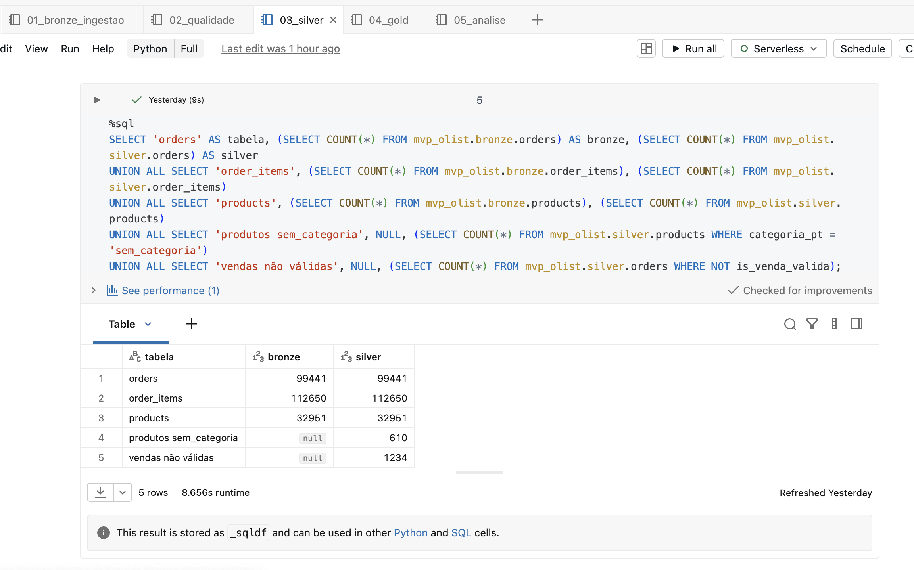

### Gold: modelo dimensional (`04_gold`)

- Criação da `dim_tempo` (calendário via `sequence()`), da `dim_produto` (com surrogate key) e da `fato_vendas` (só vendas válidas).
- Declaração de PK e FK no Unity Catalog.
- `COMMENT` em todas as colunas (catálogo de dados).

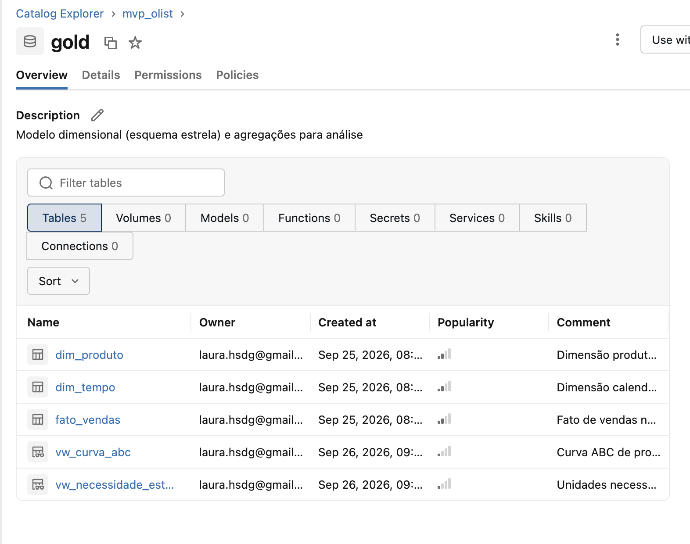

A linhagem gerada automaticamente pelo Unity Catalog mostra o caminho das tabelas Silver até a fato e dela até as views de análise:

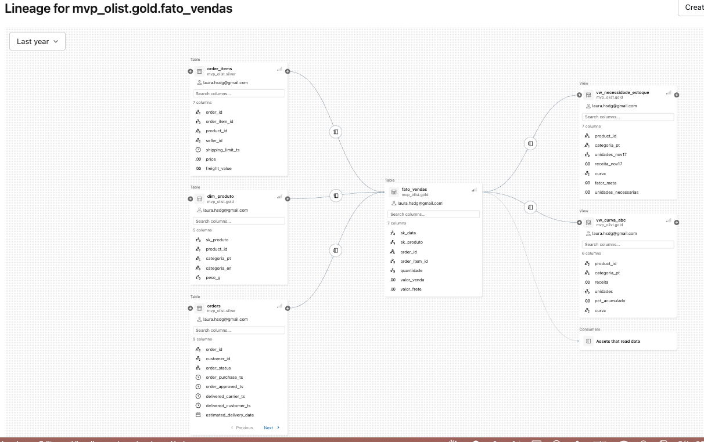

Primeira validação do modelo: a receita mensal mostra o pico em novembro/2017 (R$ 1,00M), confirmando o efeito da Black Friday nos dados.

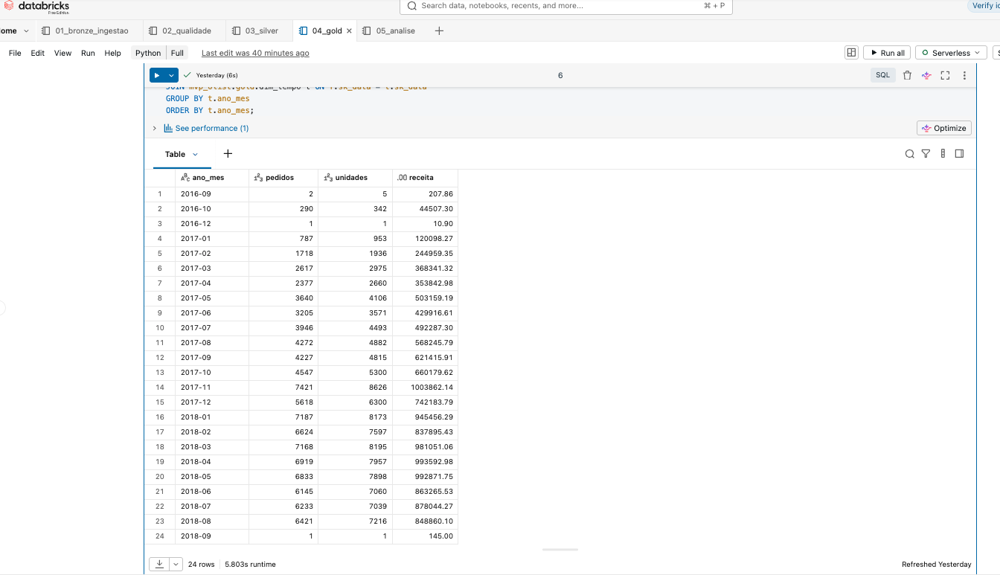

---

## 5. Qualidade de Dados (Etapa 4.5)

O diagnóstico (`02_qualidade`) foi feito **na Bronze, antes de qualquer transformação**, nas tabelas usadas pelo objetivo. Seguiu os critérios de qualidade vistos em Gestão e Governança de Dados: completude, unicidade, consistência, acurácia, integridade referencial e outliers.

| # | Achado | Critério | Tratamento na Silver |
|---|---|---|---|
| 1 | 610 produtos sem categoria (1,85%) | Completude | Preenchidos com `sem_categoria`. O produto não é descartado, porque sua receita conta para a meta |
| 2 | 2 categorias sem tradução para o inglês | Integridade referencial | Fallback para o nome em português |
| 3 | Colunas de nome, descrição e fotos com 610 nulos e erro de digitação no nome (`lenght`) | Completude / consistência | Removidas, porque estão fora do escopo |
| 4 | 2 produtos sem peso e dimensões | Completude | Mantidos nulos, porque não afetam as perguntas |
| 5 | 2.965 pedidos sem data de entrega e 160 sem aprovação | Completude | Mantidos nulos, porque correspondem a pedidos não entregues ou cancelados (comportamento esperado) |
| 6 | Zero duplicatas e zero registros órfãos entre as tabelas | Unicidade / integridade | Nenhum tratamento necessário |
| 7 | Datas 100% válidas, de 04/09/2016 a 17/10/2018 | Consistência | Convertidas para timestamp; as pontas com poucos pedidos ficam fora das comparações mensais |
| 8 | 625 pedidos `canceled` e 609 `unavailable` | Acurácia (regra de negócio) | Flag `is_venda_valida = false`; excluídos da fato |
| 9 | Preços de R$ 0,85 a R$ 6.735 (p99 = R$ 889,99) e frete mínimo de R$ 0 | Outliers | Mantidos: são vendas reais de produtos caros, e frete zero é frete grátis |

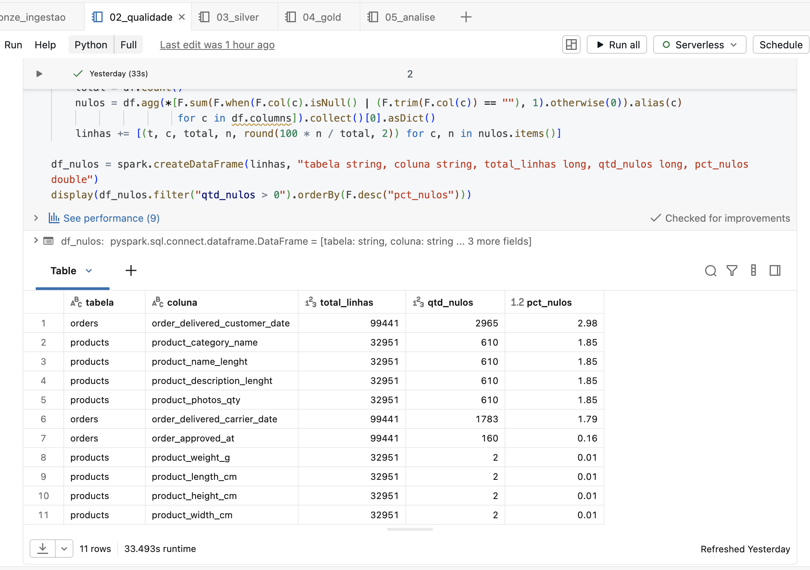

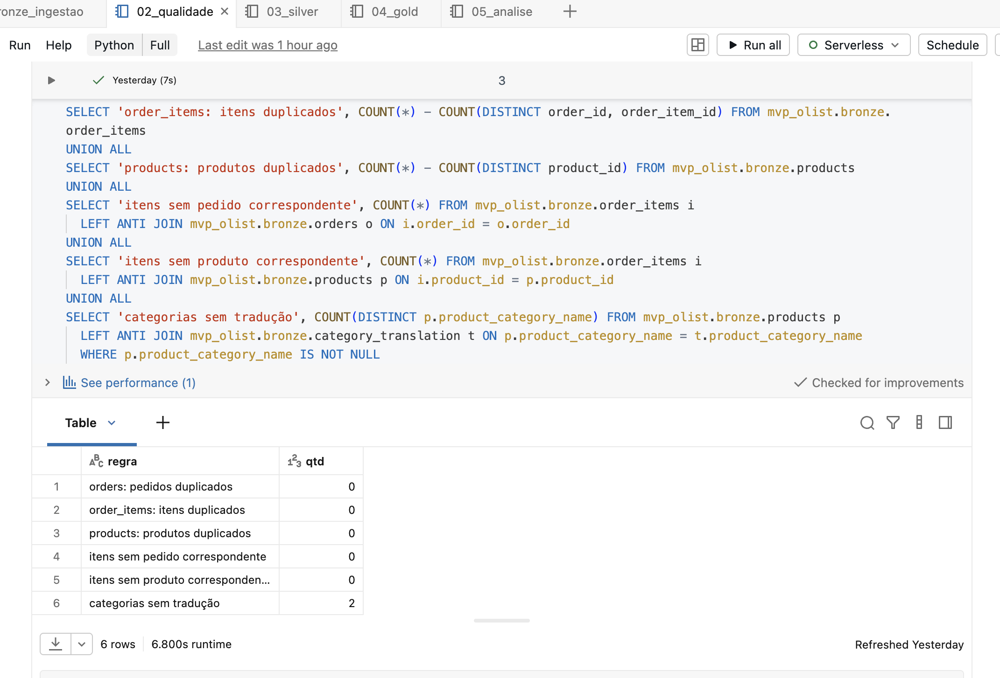

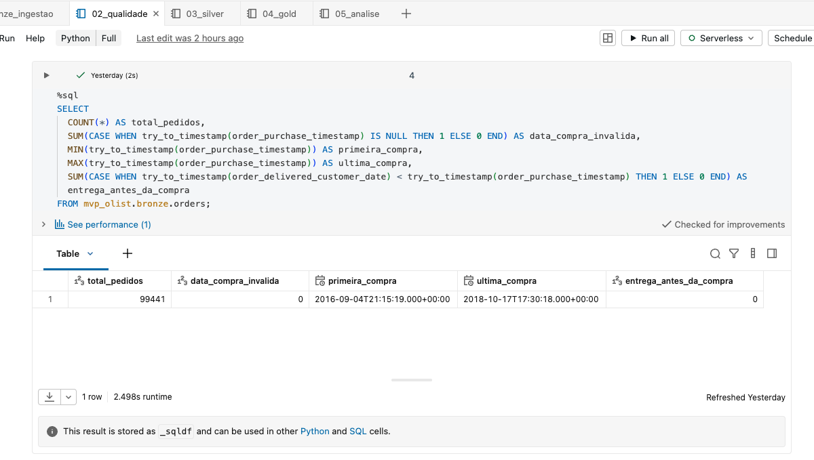

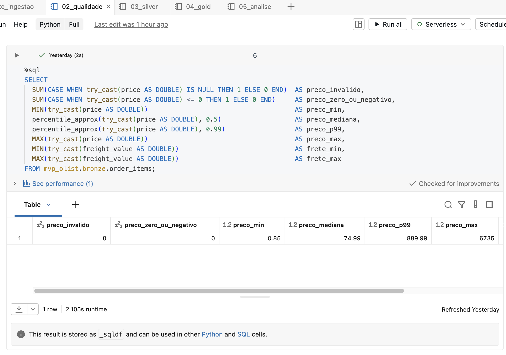

---

## 6. Análise de Dados (Etapa 4.5)

As consultas completas estão em `notebooks/05_analise.ipynb`.

### P1: Curva ABC

| Curva | Produtos | % produtos | % receita |
|---|---|---|---|
| A | 8.429 | 25,9% | 80% |
| B | 11.180 | 34,3% | 15% |
| C | 12.969 | 39,8% | 5% |

26% dos produtos geram 80% da receita. A concentração é menor que o "20/80" clássico, típico de marketplace com cauda longa. Para o estoque, a curva A é onde a ruptura mais custa e deve ter prioridade de compra. A curva C pode operar com estoque mínimo ou sob demanda.

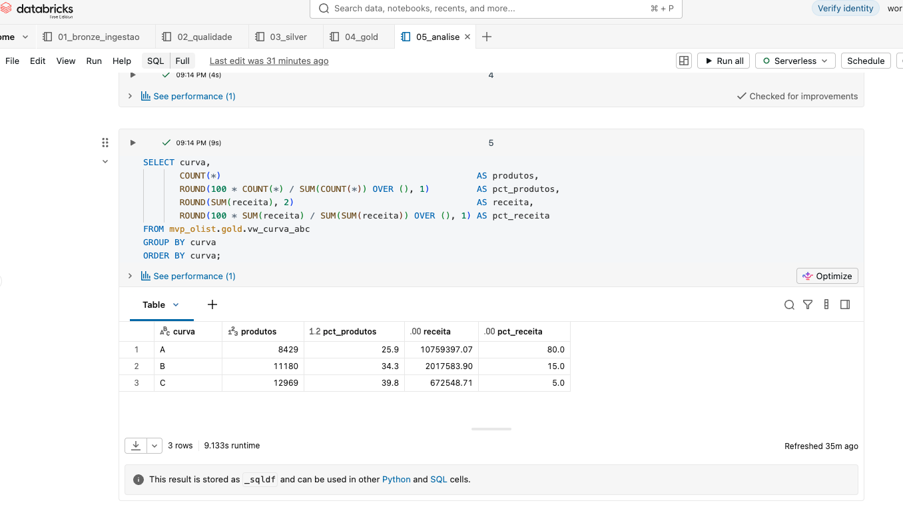

### P2: Black Friday 2017

Nos 4 dias da Black Friday 2017 (24 a 27/11), as 5 maiores categorias concentraram **43,8% da receita**: cama_mesa_banho (11,7%), relogios_presentes (8,4%), informatica_acessorios (8,0%), beleza_saude (8,0%) e moveis_decoracao (7,7%). É nessas categorias que um erro de previsão de estoque tem maior impacto no resultado da data.

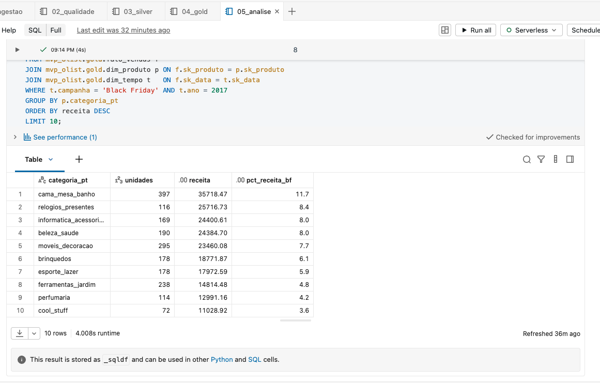

### P3: Black Friday × Dia das Mães

O mix das duas campanhas é bem diferente: relógios e presentes saltam de 8,4% para 14,8% no Dia das Mães, enquanto cama_mesa_banho e brinquedos caem pela metade. **O Dia das Mães não serve como referência para o estoque da Black Friday.** O planejamento deve partir da BF do ano anterior.

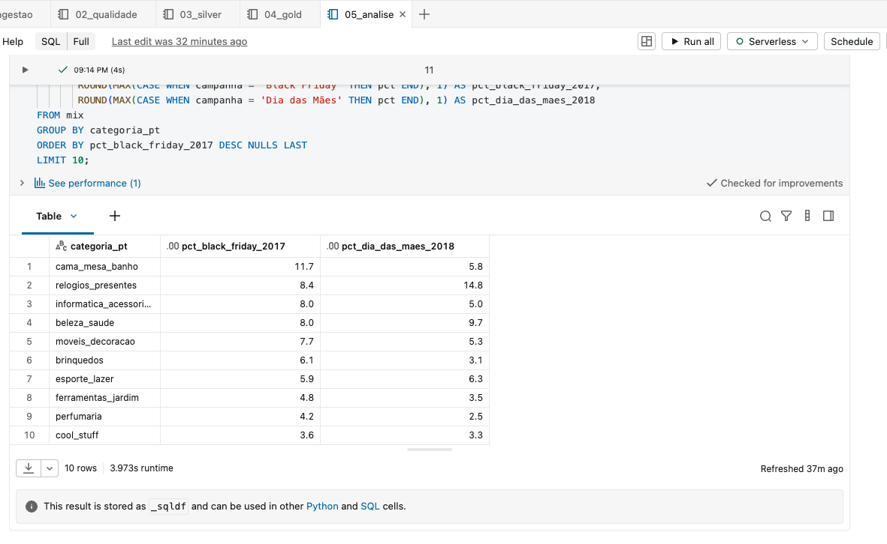

### P4: Sazonalidade e crescimento necessário

| Indicador | Valor |
|---|---|
| Receita nov/2017 | R$ 1.003.862 |
| Média mensal ago–out/2017 | R$ 616.614 |
| **Fator sazonal da Black Friday** | **1,63x** |
| Crescimento necessário sobre nov/2017 | +99,2% |

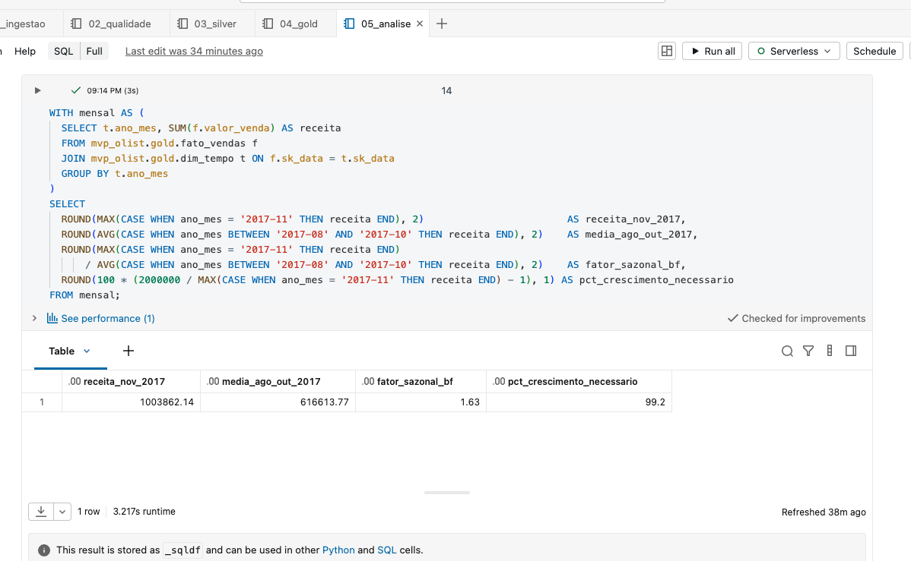

**Projeção para nov/2018:** aplicando o fator 1,63 sobre a média mensal de 2018 (R$ 917.630), a projeção é de **R$ 1,50M**. O efeito natural da data entrega cerca de 75% da meta; os **R$ 504 mil restantes (25%)** dependem de ações comerciais adicionais.

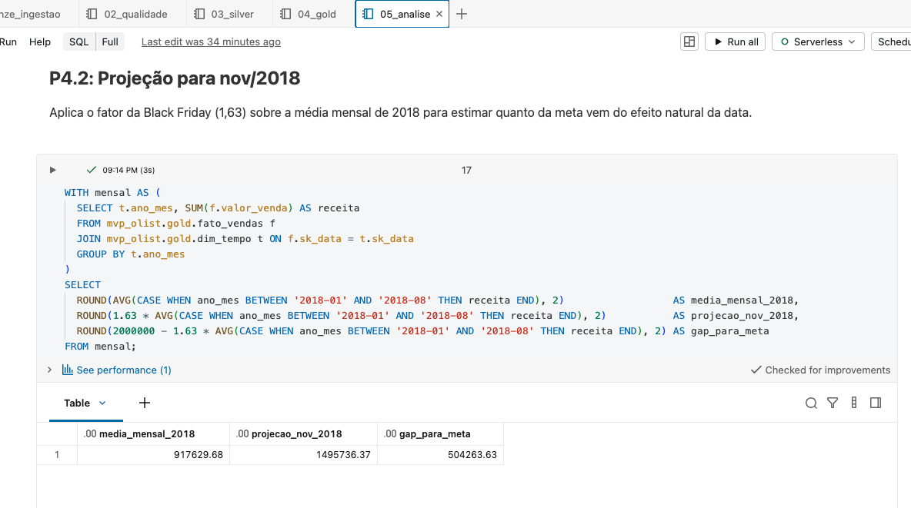

### P5: Necessidade de estoque

Mantendo o mix e o preço médio de nov/2017, a meta exige **o dobro das unidades** vendidas na curva A.

| Categoria | Produtos curva A | Unidades nov/2017 | Unidades necessárias nov/2018 |
|---|---|---|---|
| cama_mesa_banho | 237 | 654 | 1.308 |
| ferramentas_jardim | 41 | 501 | 1.002 |
| moveis_decoracao | 140 | 468 | 936 |
| beleza_saude | 128 | 404 | 808 |
| informatica_acessorios | 136 | 366 | 732 |

Categorias concentradas em poucos produtos merecem atenção: ferramentas_jardim precisa de 1.002 unidades em apenas 41 produtos (~24 por produto), enquanto cama_mesa_banho distribui 1.308 unidades em 237 produtos. Quanto maior a concentração, maior o risco de ruptura.

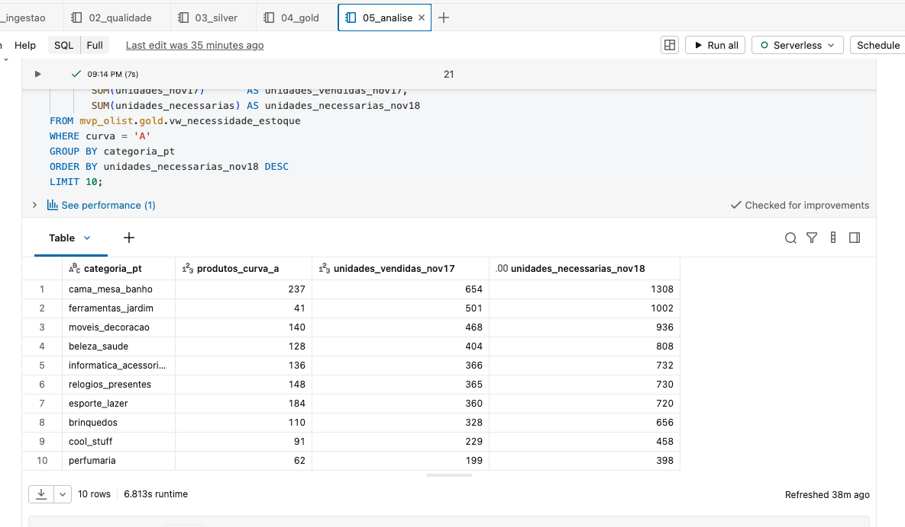

### P6: O estoque disponível cobre a necessidade?

**Não respondida.** A base Olist não possui dados de estoque, então não é possível comparar a necessidade calculada na P5 com o estoque disponível.

### Discussão geral

1. **Onde focar (P1):** 26% dos produtos (curva A) geram 80% da receita, e é nesse grupo que a ruptura de estoque mais custa.
2. **O que vende na BF (P2/P3):** o mix da Black Friday é próprio (casa, eletrônicos, beleza) e difere do Dia das Mães (presentes). O planejamento deve partir da BF anterior, não de outra campanha.
3. **Quanto a meta exige (P4):** a BF multiplica o mês por 1,63x. Aplicado à média de 2018, isso projeta R$ 1,50M, e a meta de R$ 2M exige R$ 504 mil (25%) além do efeito natural da data.
4. **Quanto estocar (P5):** para a meta, seria preciso o dobro das unidades de nov/2017 na curva A. Categorias concentradas em poucos produtos têm maior risco de ruptura e devem ser priorizadas na compra.
5. **O que não foi respondido (P6):** sem dados de estoque, não é possível confirmar a cobertura da necessidade calculada.

**Recomendação:** estocar a curva A para o cenário projetado (~1,5x nov/2017) e condicionar a compra adicional (até 2x) a ações comerciais que justifiquem o gap, evitando capital parado em estoque.

---

## 7. Autoavaliação

### Objetivos atingidos

O pipeline completo foi construído na nuvem: ingestão bruta, diagnóstico e tratamento de qualidade, modelo dimensional com catálogo e linhagem, e análise. Cinco das seis perguntas foram respondidas. Além de responder, a análise questionou a própria meta: mostrou que R$ 2M exige 25% além do efeito natural da Black Friday, o que muda a decisão de compra de estoque. O valor de 2M é uma meta que depende da capacidade operacional da empresa em outros âmbitos além do estoque (caixa para compra dos materiais, divulgação do time de marketing e vendas, disponibilidade de espaço para guardar o estoque e embalagens, etc)

### Dificuldades

- **Ausência de estoque na base:** a pergunta central ("terei estoque?") não pôde ser respondida integralmente. A solução foi reformular o problema para **necessidade de estoque**, que a base permite calcular, e manter a P6 declarada como não respondida.
- **Ausência de custo do produto:** impediu análises de margem, que seriam naturais para a decisão de estoque.
- **Ausência de marcação de campanhas:** as janelas da Black Friday e do Dia das Mães foram definidas por calendário na `dim_tempo`, não por um registro oficial de promoções.
- **Cauda longa de produtos:** cerca de 32 mil produtos, a maioria vendida poucas vezes, tornam a previsão por produto instável. Por isso a necessidade de estoque foi apresentada por categoria.

### Trabalhos futuros

- Aplicar o mesmo pipeline a **dados reais de uma operação com estoque**, para responder a P6, comparando necessidade × disponível e gerando uma lista de compras.
- Incluir custo do produto para analisar margem de contribuição por pedido na Black Friday.
- Substituir o fator sazonal simples por um modelo de previsão de demanda, por exemplo com séries temporais.
- Orquestrar o pipeline com Databricks Workflows para atualização periódica.
- Implementar **SCD tipo 2** na `dim_produto`, para versionar mudanças de categoria ao longo do tempo.

---

## Referências

- OLIST. *Brazilian E-Commerce Public Dataset by Olist*. Kaggle. Disponível em: https://www.kaggle.com/datasets/olistbr/brazilian-ecommerce
- KIMBALL, R.; ROSS, M. *The Data Warehouse Toolkit: The Definitive Guide to Dimensional Modeling*. 3. ed. Wiley, 2013.
- DAMA International. *DAMA-DMBOK: Data Management Body of Knowledge*. 2. ed. Technics Publications, 2017.
- Material das disciplinas Banco de Dados, Data Warehouse e Data Lake e Gestão e Governança de Dados (PUC-Rio, 2026).
